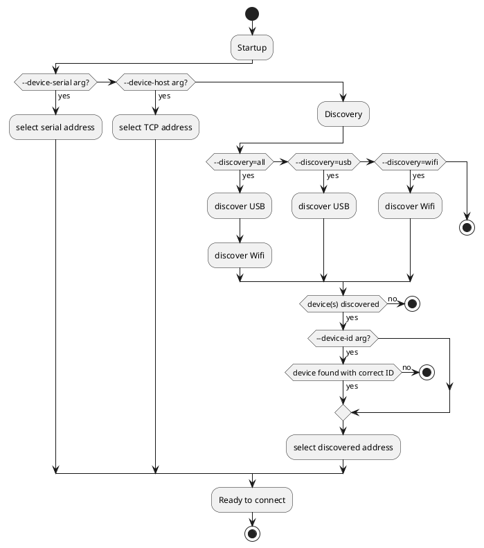

# Spark Connection Settings

The Spark service can connect to the controller using either Wifi, or USB. <br>
Controllers can either be automatically discovered, or connected to by address.

Connection settings are specified by editing the Spark service arguments in the `docker-compose.yml` file.

## Wifi vs USB

Wifi and USB have their own set of advantages and disadvantages while connecting. Once connected, both will behave the same.

Wifi:
- Spark controller must be in the same Wifi network as the service host (Raspberry Pi).
- Spark controller must be logged in to the wifi network (`brewblox-ctl wifi`).

USB:
- Spark controller must be connected to service host (Raspberry Pi) over USB.
- Spark controller must be plugged in before Spark service is started.

## Discovery vs Address

The Spark service is able to automatically discover Spark controllers over both Wifi and USB.

Note that the order in which controllers are discovered is not guaranteed.
If you are using multiple Spark controllers, you will want to specify a device address or serial number.

The Spark service uses multiple arguments to determine how and where to find the Spark controller it should connect to.
These arguments are:
* `--device-serial`
* `--device-host`
* `--discovery`
* `--device-id`

The following diagram is a (simplified) display of the decision process to select a device.
If discovery fails, the service reboots. This is because of a limitation in how Docker handles USB devices: the service must be started after the device was plugged in.



`--device-serial` and `--device-host` are the most specific arguments, and will take priority.
Note that device ID will not be checked when using these arguments.

Examples:
```yaml
  spark-one:
    ...
    command: >
      --device-host=192.168.0.60
```
```yaml
  spark-one:
    ...
    command: >
      --device-serial=/dev/ttyACM0
```

`--discovery` has three possible values: `all`, `usb`, or `wifi`. `all` is the default. <br>
Because USB devices are more specific, they will always be checked first.

`device-id` is used to disqualify discovered devices. If `--device-id` is not set, all discovered devices are valid.

The argument value is the unique device ID of your Spark controller. There are multiple ways to get this ID.

If your Spark controller is connected to Wifi, you can navigate to its IP address in your browser.


If your Spark controller is connected over USB, you can get its device ID by running the following command in your terminal:

```bash
docker run --rm --privileged brewblox/brewblox-devcon-spark:rpi-edge --list-devices
```

Example output (SER is the device ID):

```bash
pi@brewpipi:~/brewblox $ docker run --privileged brewblox/brewblox-devcon-spark:rpi-edge --list-devices
2019/02/01 10:41:05 INFO     brewblox_service.service        Creating [spark] application
2019/02/01 10:41:05 INFO     __main__                        Listing connected devices:
2019/02/01 10:41:05 INFO     __main__                        >> /dev/ttyACM0 | P1 - P1 Serial | USB VID:PID=2B04:C008 SER=300045000851353532343835 LOCATION=1-1.2:1.0
```

Specific device, over Wifi or USB:
```yaml
  spark-one:
    ...
    command: >
      --device-id=300045000851353532343835
```
Specific device, USB only:
```yaml
  spark-one:
    ...
    command: >
      --discovery=usb
      --device-id=300045000851353532343835
```
First discovered device, Wifi only:
```yaml
  spark-one:
    ...
    command: >
      --discovery=wifi
```
